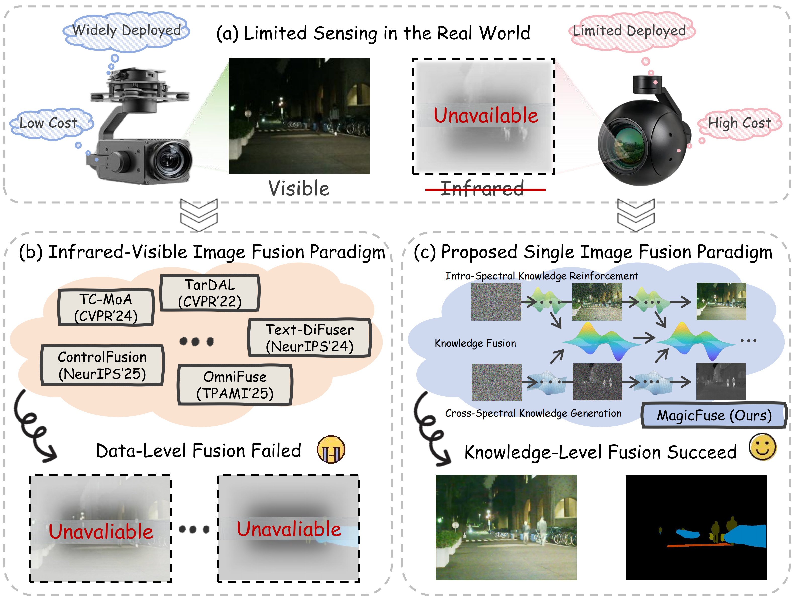
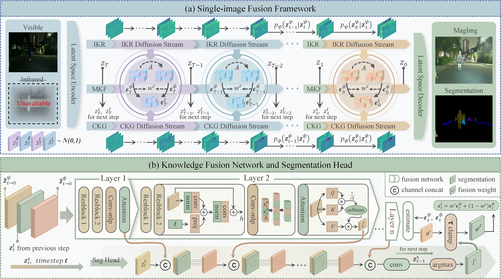

<div align="center" style="text-decoration: none !important;">
    <h1>
      <a href="https://arxiv.org/abs/2602.01760" target="_blank" style="text-decoration: none !important;">MagicFuse: Single Image Fusion for Visual and Semantic Reinforcement
 [CVPR 2026]</a> 
    </h1>
    <div>
        <a href='https://github.com/HaoZhang1018' target='_blank' style="text-decoration: none !important;">Hao Zhang<sup>1*</sup></a>,&emsp;
        <a href='https://github.com/zhayanping' target='_blank' style="text-decoration: none !important;">Yanping Zha<sup>1*</sup></a>,&emsp;
        <a href='https://github.com/ZizhuoLi' target='_blank' style="text-decoration: none !important;">Zizhuo Li<sup>1</sup></a>,&emsp;
        <a href='https://github.com/Meiqi-Gong' target='_blank' style="text-decoration: none !important;">Meiqi Gong<sup>1</sup></a>,&emsp;
        <a href='https://sites.google.com/site/jiayima2013' target='_blank' style="text-decoration: none !important;">Jiayi Ma<sup>1&#8224;</sup></a>
    </div>
    <div>
        <sup>1</sup>Wuhan University &emsp;
        <sup>*</sup>Equal Contribution &emsp; <sup>&#8224;</sup>Corresponding Author
    </div>
    <br>
    <div style="text-decoration: none !important;">
        <a href="https://github.com/zhayanping/MagicFuse" target='_blank' style="text-decoration: none !important; border: none !important;">
            
        </a>
        <a href="https://arxiv.org/abs/2602.01760" target='_blank' style="text-decoration: none !important; border: none !important;">
            
        </a>
        <a href="https://cvpr.thecvf.com/virtual/2026/poster/39885" target='_blank' style="text-decoration: none !important; border: none !important;">
            
        </a>
    </div>
</div>

## 🔎 Method Overview

###  Motivation



###  Framework



## 🛠️ Create Environment

1. **Clone this repository:**

   ```bash
   git clone https://github.com/zhayanping/MagicFuse.git
   cd MagicFuse
   ```

2. **Create a Conda environment (recommended):**

   ```bash
   conda create -n MagicFuse python=3.12
   conda activate MagicFuse
   ```

3.  **Install dependency packages:**
    
    ```bash
	pip install -r requirements.txt
	```

## 📥 Pre-trained Weights
#### Download the pretrained weights for the CKG and IKR diffusion branches from [Baidu Drive](https://pan.baidu.com/s/1WdY461RUguKVzNAVNptrLQ?pwd=b88v ), and place them in the following directories: `pretrained/CKG` and `pretrained/IKR`.

## 🏋️ Training

Our project adopts a distributed training mode, you can modify the relevant settings in the `train.py` file to specify the appropriate CUDA device identifier for training. Please store the training data in the following format:

```python
 Fusion
 ├──train
    ├── vis
    ├── label
```

## 🧪 Testing
⚡ `quicktest.ipynb`  Used for quick testing on single images. You can modify the input/output paths directly in the Jupyter Notebook to easily check the inference results of a single image.

⚡ `test.py`  Designed for large-scale image testing tasks. This script supports multi-GPU parallel testing to efficiently process large batches of images. If you need to adjust the image size for testing, you can configure it in the `dataset.py` file.

⚡ `test4largeImg.ipynb`  Specifically developed for testing large-size images. It adopts a dynamic model loading strategy to effectively save GPU memory usage.
